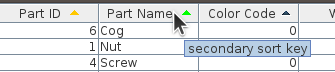

## table-sort-header-renderer



When sorting, the regular Java Swing JTable column header cell renderer only displays ascending/descending arrows for the primary key column; and the code is inaccessible and hidden away under `package sun.swing`. This project's artifact handles those problems.
- colored arrows and column header ToolTips are defined for up to 3 sort keys
- developers can define their own icons and ToolTips
- developers can add additional icons, used if more that 3 sort keys are enabled
- the renderer can be extended, for example to customize the ToolTips

The artifact is `jdk1.8` compatible.

A simple way to use this is:
```java
class MyTable extends JTable
{
    @Override
    protected JTableHeader createDefaultTableHeader() {
        return new JTableHeader(columnModel) {
            @Override
            protected TableCellRenderer createDefaultRenderer() {
                return new TableSortHeaderRenderer();
            }
        };
    }
}
```
```xml
<dependency>
    <groupId>com.raelity.jdk</groupId>
    <artifactId>table-sort-header-renderer</artifactId>
    <version>1.0.1</version>
</dependency>
```

#### Notes

`TableSortHeaderRenderer` is a modification of `sun.swing.table.DefaultTableCellHeaderRenderer`; other than supporting more than one sort key arrow display, if it does not behave the same then it is an issue/bug.

The additional icons have `-<integer-id>` appended to them, where `integer-id` is in the range `1..(nKey-1)`. For example, for the secondary sort key there is
- `"Table.ascendingSortIcon-1"`
- `"Table.descendingSortIcon-1"`
- `"Table.naturalSortIcon-1"`

When the class `TableSortHeaderRenderer` is loaded, it defines icons using `UIManager.put()` for secondary and tertiary sort arrows _only if the key's object is null_. So developer defined defaults are not over written. 

The boolean default `TableHeader.rightAlignSortArrow` is supported.

